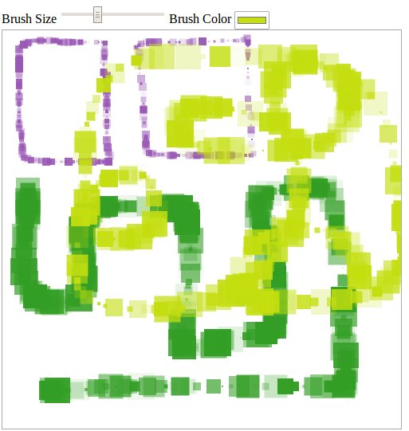

# Fabric Square Brush

This is a square brush for [fabric.js](https://github.com/kangax/fabric.js/raw/master/LICENSE).

## HOW TO

To use this brush, load the script after fabric.js script has been loaded. If fabric.js has not been loaded, then this brush will fail.

Please see the  demo's source code to see an example how that implemented.

But basic usage is as follow:

    var canvas = new fabric.Canvas(/*Please insert the canvas id here*/);

    canvas.isDrawingMode = true;
    canvas.freeDrawingBrush = new fabric.SquareBrush(canvas);

## TODO

+ Exposing the module using CommonJS, AMD.
+ Rotate the square while drawing